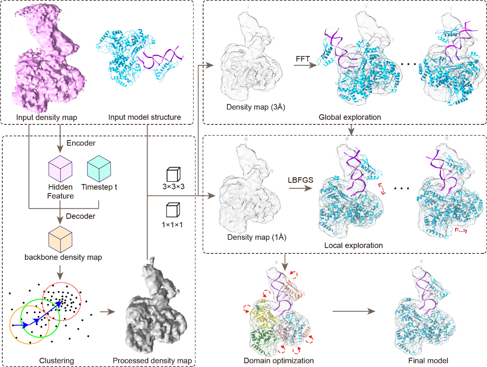

# DEMO-EMfit: Coupling Deep Learning-Enhanced Map Processing with Global-Local Optimization for Protein Structure Fitting in Cryo-EM Maps

<h4 align = "center">Yaxian Cai1,2, XXXXX2, XXXXX1, XXXXX1, Xiaogen Zhou1</h4>
<h4 align = "center"> $^1$ Zhejiang University of Technology
</h4>
<h4 align = "center">$^2$ XXXXX</h4>
                     
                       

## Abstract
With the breakthroughs in protein structure prediction technology, constructing atomic structures from cryo-electron microscopy (cryo-EM) density maps through structural fitting has become increasingly critical. However, the accuracy of the constructed models heavily relies on the precision of structure-to-map fitting. In this study, we introduce DEMO-EMfit, a progressive method that integrates deep learning-based backbone map extraction with a global-local structural pose search to fit protein structures into density maps. DEMO-EMfit was extensively evaluated on a benchmark dataset comprising both cryo-electron tomography (cryo-ET) and cryo-EM maps. The results demonstrate that DEMO-EMfit outperforms state-of-the-art approaches, offering an efficient and accurate tool for protein structure fitting in density maps.

## Our Pipeline

## Dependencies

* Install 32-bit Dynamic Linker
CentOS:
   >sudo yum install epel-release -y
   >sudo yum install glibc.i686

* Install boost
CentOS:
   >yum install boost boost-devel

## How to run DEMO-EMfit

In Linux system with 64-bit and the right directory, you can run the program in the command window without arguments to obtain a brief instruction

>./DEMO-EMfit

Here, an example is shown as follows:

>./DEMO-EMfit  model  map   resolution
>./DEMO-EMfit /example/chainl.pdb /example/map.mrc 3.2
>./DEMO-EMfit /example/chains   /example/map.mrc 3.2 -dc 0.005

## Options in DEMO-EMfit
		 << Options:
		 << "       -fit  Whether to perform flexible model fitting
		 << "             0: (default) perform rigid-body model fitting only, and domain-based 
		 << "                 optimization can be performed using '-dbo 1			 
		 << "             1: perform complex reassembly and domain-based optimization
		 << "       -dc   density threshold (recommended contour level), default: 0
		 << "       -ct   CC cutoff for good fitting when use '-fit 1', default: 0.6 	 
		 << "       -gwg  map grid width for global exploration, default: 3		 
		 << "       -gwl  map grid width for local exploitation, default: 0 (original) 
		 << "       -nco  number of parallel threads, default: all cores		  
		 << "       -dbo  Whether to perform domain based optimization when use '-fit 0'
		 << "             0: (default) only perform rigib-body fitting
		 << "             1: perform domain-based optimization 	 
		 << "       -sl   Whether to print intermediate information
		 << "             0: (default) no
		 << "             1: yes			

		 << " Following options are only for test:
		 << "       -ngb  number of poses to explore by global fitting, default: 20 		 
		 << "       -nlc  number of poses to explore by local fitting, default: 20 			 
		 << "       -seg  perform map segmention based on contour (0:no, 1:yes), default: 1 
		 << "       -s6   perform grid searching for inital positions (0:no, 1:yes), default: 0		 
		 << "       -gb   run global exploration only (0:no, 1:yes)
		 << "       -lc   run local explitation only (0:no, 1:yes)	 
		 << "       -rm   remove matched map region for '-fit 1'(0:no, 1:yes)
		 << "       -it   assembly by iteration for '-fit 1'(0:no, 1:yes), default: 1
		 << "       -i6d  use initial fittings by global searching (0:no, 1:yes), default: 1		 
		 << "       -lco  run local domain optimization for '-fit 1'(0:no, 1:yes), default: 1 
		 << "       -dmm  run domain matching for '-fit 1'(0:no, 1:yes), default: 1 

		 << " Notes: 
		 << "        "<< Input model can be a PDB file or a directory containing multiple models.
		 << "        "<< Models should be in separate directories or write in a PDB file if you 
		 << "        "<< have multiple models to fit, such as when assemble multiple chains. 
		 << "        "<< All models should be in PDB format, and maps should be in MRC/CCP4 format.		 
		 << "        "<< '-rsc' shoule be in (0,1), recommend: 0.6.
		 << "        "<< '-dc' shoule be in (0,1), recommend: 0.005. 
		 << "        "<< Output models are named as 'CEMO_opt.pdb' and saved in 'model_path'.

##  Evaluating the quality of the model
Users can calculate Correlation Coefficient (CC)and integrated Fourier Shell Correlation (iFSC) between the model and density map to mesure the quality of fitness.  

Usage:./CalCC map_path  model_path  resolution

	Required arguments:
		map: input density map.
		model: DEMO-EMfit fited model.
		resolution: resolution of the density map.

	Options:
		-tp: atom type for correlation score calculation,"CA","BB","all"
		-gw: grid width of the map, 0: original value 
		-rc: types of score,"cc","rscc","fc","ifsc"
		-sl: flag to output intermediate information, 0: no 1: yes 
	Notes:
		<<-tp supports "CA","BB" and "all",where they indicate CA atoms, backbone atoms, and all atoms, respectively.
		<<fc indicates fast density score. 
		<<cc indicates correlation coefficient score. 
		<<rscc indicates correlation score in fraction space. 
		<<ifsc indicates integrated Fourier Shell Correlation. 
		<<All scores are the higher the better.
		<<The program will interpolate a new map with voxel size equal to the given value if the provided grid width is greater than the original one.
  
## Abouts          
Please report bugs and questions to zxg@zjut.edu.cn
	

